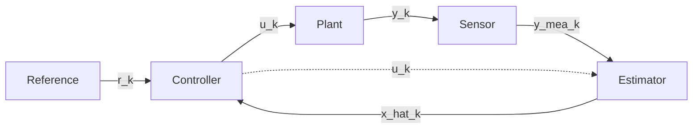

# simulate

A modular Python framework for control system simulation, designed for flexibility, extensibility, and modern software engineering practices.

## Overview

`simulate` provides a block-based architecture for simulating complex feedback control systems. It emphasizes a strict separation between physical models (Plants), hardware interfaces (Sensors), and computational logic (Estimators, Controllers, References).

### Key Features

- **Modular Architecture:** Build systems by subclassing core components: `Plant`, `Sensor`, `Estimator`, `Controller`, and `Reference`.
- **Multi-Rate Support:** Components can operate at different sample rates, provided they are integer multiples of the plant's base time step.
- **Zero-Order Hold (ZOH):** Automatic handling of sample time synchronization.
- **Configuration-Driven:** Simulations are defined in human-readable YAML files, allowing for dynamic loading of components without code changes.
- **Robust Numerical Integration:** Includes built-in support for Euler, Midpoint, and RK4 integration schemes for continuous-time plant dynamics.
- **Component-Driven Logging:** Standardized logging of universal signals (t, x, u, y, etc.) alongside strictly-typed internal component data via Pydantic models.
- **High-Performance Batch Execution:** Run large-scale experiments in parallel using multiprocessing, with results written directly to disk (CSV or NPZ).

## Core Components

Each component in the framework represents a specific mathematical operation in the feedback control loop:

- **Reference:** Generates desired trajectories or setpoints (e.g., Step, Sine): $r_k = \sigma(t_k)$
- **Plant:** The mathematical model of the physical system.
  - **Discrete-time:** $x_{k+1} = f(t_k, x_k, u_k)$
  - **Continuous-time:** $\dot{x} = f(t, x, u)$ (solved via numerical integrators)
  - **Output:** $y_k = g(t_k, x_k, u_k)$
- **Sensor:** Models measurement hardware: $\tilde{y}_k = h(t_k, y_k)$
- **Estimator:** Reconstructs state based on noisy measurements and control inputs: $\hat{x}_k = e(t_k, \tilde{y}_k, u_{k-1})$
- **Controller:** Implements control laws (e.g., PID, MPC) to compute control actions based on the error or state estimate: $u_k = c(t_k, r_k, \hat{x}_k)$


### Prebuilt Components

The framework includes several prebuilt components for standard control engineering tasks:

- **`LinearPlant`:** Implements state-space representations. Supports both discrete-time ($x_{k+1} = A x_k + B u_k$) and continuous-time ($\dot{x} = A x + B u$) dynamics, outputting $y = C x + D u$.
- **`IdentityEstimator`:** A simple pass-through estimator that assumes full and perfect state measurement: $\hat{x}_k = \tilde{y}_k$.
- **`PIDController`:** A standard Proportional-Integral-Derivative controller using matrix gains: $u_k = K_p e_k + K_i \int e_k dt + K_d \frac{de_k}{dt}$, where $e_k = r_k - \hat{x}_k$.
- **`StepReference`:** Generates a step signal or trajectory jumping to a specified value at a given start time: $r_k = \begin{cases} 0 & t < t_{start} \\ r_{step} & t \ge t_{start} \end{cases}$.
- **`GaussianSensor`:** Simulates sensor noise by adding zero-mean Gaussian noise to the true plant output: $\tilde{y}_k = y_k + \mathcal{N}(0, \sigma^2)$.




## Getting Started

### Installation

This project uses [uv](https://github.com/astral-sh/uv) for dependency management.

1.  **Install `uv`**:
    ```bash
    curl -LsSf https://astral.sh/uv/install.sh | sh
    ```

2.  **Sync dependencies**:
    ```bash
    uv sync
    ```

3.  **Set up pre-commit hooks** (optional, but recommended):
    ```bash
    uv run pre-commit install
    ```

### Running a Simulation

Execute a simulation using a configuration file:

```bash
uv run python main.py --config configs/basic_pid.yaml --export both
```

- `--config`: Path to your YAML configuration.
- `--export`: Results format (`csv`, `npz`, or `both`).
- `--output-dir`: Where to save results (default: `results`).

## Configuration Example

```yaml
t_end: 10.0
plant:
  class_path: "simulate.plant.LinearPlant"
  dt: 0.01
  a: [[0, 1], [-10, -1]]
  b: [[0], [1]]
  c: [[1, 0]]
  d: [[0]]
  integrator: "simulate.integrator.rk4"
reference:
  class_path: "simulate.reference.StepReference"
  dt: 0.01
  step_value: 1.0
  start_time: 1.0
sensor:
  class_path: "simulate.sensor.GaussianSensor"
  dt: 0.01
  std_dev: 0.05
estimator:
  class_path: "simulate.estimator.IdentityEstimator"
  dt: 0.01
controller:
  class_path: "simulate.controller.PIDController"
  dt: 0.01
  kp: [[5.0]]
  ki: [[2.0]]
  kd: [[0.5]]
```

## Development

### Running Tests

```bash
uv run pytest
```

### Linting and Formatting

The project uses [Ruff](https://github.com/astral-sh/ruff) for linting and formatting.

```bash
uv run ruff check .
uv run ruff format .
```

### Type Checking

```bash
uv run mypy .
```
