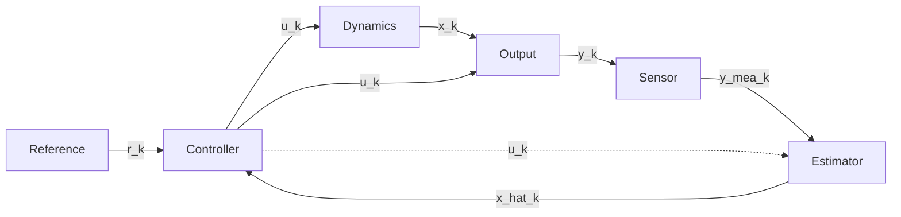

# simulate

A modular Python framework for control-system simulation, designed for flexibility,
extensibility, and modern software-engineering practices.

This repository ships **two packages**:

- **`simulate`** — a generic, configuration-driven engine for closed-loop control
  simulation. It defines the block-based `Component` model (Dynamics, Output, Sensor,
  Estimator, Controller, Reference), the multi-rate orchestrator, logging, and batch
  experimentation.
- **`spacecraft`** — a domain extension built **on top of** `simulate`. It provides
  6-DOF rigid-body attitude/orbit dynamics with composable effectors, plus a full
  ADCS stack (attitude controllers, a full-state estimator, sensors/measurements,
  and references).

`spacecraft` components are ordinary `simulate` components, so everything in
[Part 2](#part-2--the-simulate-package) applies to [Part 3](#part-3--the-spacecraft-package)
as well.

---

## Part 1 — Getting Started

### Installation

This project uses [uv](https://github.com/astral-sh/uv) for dependency management.

1. **Install `uv`**:

   ```bash
   curl -LsSf https://astral.sh/uv/install.sh | sh
   ```

2. **Sync dependencies**:

   ```bash
   uv sync
   ```

   The heavy aerospace dependencies (astropy, sgp4, casadi, pyigrf, pymap3d, pymsis,
   scipy) live in the `spacecraft` dependency group. Include them with:

   ```bash
   uv sync --group spacecraft
   ```

3. **Set up pre-commit hooks** (optional, but recommended):

   ```bash
   uv run pre-commit install
   ```

### Project structure

```text
simulate/
├── src/
│   ├── simulate/            #   Generic control-loop engine
│   │   ├── component.py     #   Component[L] base class (ZOH, multi-rate)
│   │   ├── dynamics.py      #   Dynamics + LinearDynamics
│   │   ├── output.py        #   Output + LinearOutput
│   │   ├── sensor.py        #   Sensor + GaussianSensor, RandomWalkBiasSensor
│   │   ├── estimator.py     #   Estimator + IdentityEstimator
│   │   ├── controller.py    #   Controller + PIDController
│   │   ├── reference.py     #   Reference + StepReference
│   │   ├── integrator.py    #   euler / midpoint / rk4
│   │   ├── logger.py        #   Universal + per-component logging
│   │   ├── experiment.py    #   Parallel batch runner
│   │   └── simulation.py    #   Simulation orchestrator
│   └── spacecraft/          #   Aerospace domain extension
│       ├── rigid_body.py    #   RigidBodyDynamics + telemetry outputs
│       ├── effector.py      #   Effector base + actuators/environment
│       ├── controller.py    #   QuaternionFeedbackController, AdaptiveLQR
│       ├── estimator.py     #   FullStateEstimator (orbit KF + attitude MEKF)
│       ├── measurement.py   #   Magnetometer / sun / GPS truth outputs
│       ├── reference.py     #   OrbitReference (nadir pointing)
│       ├── signals.py       #   Named-slice layouts for the signal vectors
│       └── ...              #   coordinate frames, quaternion, environment, disturbances
├── examples/                #   Marimo notebooks + runnable YAML configs
├── tests/                   #   Test suite (incl. differential tests)
└── main.py                  #   CLI entry point
```

### Running a simulation

**From the command line**, point `main.py` at a YAML config:

```bash
uv run python main.py --config examples/03_nadir_pointing.yaml
```

- `--config` — path to the YAML configuration (required).
- `--output-dir` — directory for results (default: `results`).
- `--chunk-size` — steps per output chunk file (default: `10000`; `0` disables chunking).
- `--compress` — enable zlib compression for output `.npz` files (default: off).

**Programmatically**, build a `Simulation` from a file or a dict:

```python
from simulate.simulation import Simulation

sim = Simulation.from_yaml("examples/03_nadir_pointing.yaml")
sim.run(output_dir="results")

# Results are available in-memory after the run:
sim.logger.universal_logs   # t, x, x_hat, u, ref, y, y_mea
sim.logger.component_logs   # per-component internal logs
```

`Simulation.from_config(config_dict)` does the same from an already-parsed dict.

The [`examples/`](examples/) directory holds interactive [marimo](https://marimo.io)
notebooks (`01_dc_motor_speed_control.py`, `02_rigid_body_attitude.py`,
`03_nadir_pointing.py`). Open one for editing, or serve it read-only as an app, with:

```bash
uv run marimo edit examples/01_dc_motor_speed_control.py   # interactive editing
uv run marimo run examples/01_dc_motor_speed_control.py    # run as an app
```

### Configuration format

A config is a flat mapping of component roles to `{class_path, dt, ...}` blocks.
`class_path` is imported dynamically and instantiated through the component's
`from_config`, so **new components need no changes to the engine** — just a reachable
import path. Each component declares its own `dt`; rates must be integer multiples of
the dynamics' base `dt` (see [multi-rate](#the-component-model)). `outputs` and
`sensors` accept either a single block or a list of parallel measurement channels.

```yaml
t_end: 10.0
dynamics:
  class_path: "simulate.dynamics.LinearDynamics"
  dt: 0.01
  a: [[0, 1], [-10, -1]]
  b: [[0], [1]]
  integrator: "simulate.integrator.rk4"
outputs:
  class_path: "simulate.output.LinearOutput"
  dt: 0.01
  c: [[1, 0]]
  d: [[0]]
reference:
  class_path: "simulate.reference.StepReference"
  dt: 0.01
  step_value: 1.0
  start_time: 1.0
sensors:
  class_path: "simulate.sensor.GaussianSensor"
  dt: 0.01
  std_dev: 0.05
estimator:
  class_path: "simulate.estimator.IdentityEstimator"
  dt: 0.01
controller:
  class_path: "simulate.controller.PIDController"
  dt: 0.01
  kp: [[5.0]]
  ki: [[2.0]]
  kd: [[0.5]]
```

### Development

```bash
uv run pytest                              # tests with coverage
uv run ruff check . --fix --unsafe-fixes   # lint (rule set "ALL" with curated ignores)
uv run ruff format .                       # format
uv run ty check                            # type checking
uv run pre-commit run --all-files          # everything the commit hook runs
```

Pre-commit runs ruff, ruff-format, ty, pytest, `uv-lock`, and markdownlint on every
commit, so running them by hand is usually unnecessary.

---

## Part 2 — The `simulate` package

### The component model

Every block in the loop is a `Component[L]` ([`src/simulate/component.py`](src/simulate/component.py)),
where `L` is a frozen dataclass for that component's internal log. The six roles map
to distinct mathematical operations:

- **Reference** — desired trajectory / setpoint: $r_k = \sigma(t_k)$
- **Dynamics** — system state transition
  - Discrete-time: $x_{k+1} = f(t_k, x_k, u_k)$
  - Continuous-time: $\dot{x} = f(t, x, u)$ (solved via a numerical integrator)
- **Output** — measured quantity from state and input: $y_k = g(t_k, x_k, u_k)$
- **Sensor** — measurement hardware model: $\tilde{y}_k = h(t_k, y_k)$
- **Estimator** — state reconstruction: $\hat{x}_k = e(t_k, \tilde{y}_k, u_{k-1})$
- **Controller** — control law: $u_k = c(t_k, r_k, \hat{x}_k)$



**Multi-rate & Zero-Order Hold.** Each component runs at its own `dt` (an integer
multiple of the dynamics' base step). The base `Component._execute_zoh` recomputes a
component only when its update time is due and otherwise holds the last output, so
slow sensors/controllers compose with fast dynamics automatically.

### Prebuilt components

| Component | Class | File |
| --- | --- | --- |
| Dynamics | `LinearDynamics` — $x_{k+1}=Ax_k+Bu_k$ / $\dot{x}=Ax+Bu$ | [`dynamics.py`](src/simulate/dynamics.py) |
| Output | `LinearOutput` — $y=Cx+Du$ | [`output.py`](src/simulate/output.py) |
| Sensor | `GaussianSensor` — additive $\mathcal{N}(0,\sigma^2)$ noise | [`sensor.py`](src/simulate/sensor.py) |
| Sensor | `RandomWalkBiasSensor` — Gaussian noise + random-walk bias | [`sensor.py`](src/simulate/sensor.py) |
| Estimator | `IdentityEstimator` — pass-through $\hat{x}_k=\tilde{y}_k$ | [`estimator.py`](src/simulate/estimator.py) |
| Controller | `PIDController` — matrix-gain PID | [`controller.py`](src/simulate/controller.py) |
| Reference | `StepReference` — step at a start time | [`reference.py`](src/simulate/reference.py) |
| Integrators | `euler`, `midpoint`, `rk4` | [`integrator.py`](src/simulate/integrator.py) |

### Using it

Assemble these by reference from YAML — the [config above](#configuration-format) is a
complete, runnable example (linear plant + PID + Gaussian sensor). Swap `class_path`
values to mix and match prebuilt and custom components.

**Multiple outputs & sensors.** `outputs` and `sensors` are parallel measurement
channels: `sensors[i]` adds noise to the truth produced by `outputs[i]`, so the two
lists must be the same length. Each output transforms the plant state at the base `dt`
(always-fresh truth), while its paired sensor may subsample at its own slower rate —
letting you model, say, a fast gyro alongside a slow GPS fix in one run. Give each as a
single block (one channel) or a YAML list (many); the measurements are concatenated
into the `y_mea` vector handed to the estimator.

### Logging

Every step records a `UniversalLog` ([`src/simulate/logger.py`](src/simulate/logger.py))
of the standard signals — `t, x, x_hat, u, ref, y, y_mea` — plus each component's own
log dataclass. Component logs are keyed by role (`dynamics`, `reference`, `estimator`,
`controller`, and `output_0`, `sensor_0`, … per channel) and hold **only** internal
state not already in the universal log. After a run, read them in memory via
`sim.logger.universal_logs` and `sim.logger.component_logs`; when `run(output_dir=...)`
is given, logs stream to chunked `.npz` files (optionally `--compress`ed) and are merged
on `export_results`.

### Extending it: writing a new component

A custom component subclasses the role's base class and implements three things:

1. `__init__(self, dt, ...)` — store parameters and any initial state; call
   `super().__init__(dt)`.
2. `from_config(cls, config)` — a classmethod that pulls parameters out of the YAML
   dict (and resolves an `integrator` import string for dynamics).
3. The role's update method, returning `(output, log)`:
   - Dynamics: `dynamics(t, x, u)` returning $\dot{x}$ (or override `step` for
     discrete-time), plus `_make_log()`.
   - Output / Sensor / Estimator / Controller / Reference: `update(t, ...)`.

The log is a frozen dataclass holding **only** internal state not already captured by
the universal logs; use `simulate.component.NoLog` when there is nothing extra to log.

For complete, idiomatic references see
[`examples/dc_motor.py`](examples/dc_motor.py) (a custom continuous-time `Dynamics`
and `Output`) and `PIDController` in
[`src/simulate/controller.py`](src/simulate/controller.py) (the logging-dataclass
pattern). The matching notebook is
[`examples/01_dc_motor_speed_control.py`](examples/01_dc_motor_speed_control.py).

---

## Part 3 — The `spacecraft` package

### Overview

The plant is `RigidBodyDynamics` ([`src/spacecraft/rigid_body.py`](src/spacecraft/rigid_body.py)),
a `simulate` `Dynamics` integrating the coupled 6-DOF orbit + attitude state. Its
forces and torques come from a list of composable **effectors** — actuators
(reaction wheels, magnetorquers) and environmental effects (gravity, drag, SRP) are
the same interface, integrated together so state-dependent forces are evaluated at
every integrator substage.

Controllers and estimators exchange flat numpy vectors whose index conventions live
in one place: [`src/spacecraft/signals.py`](src/spacecraft/signals.py). Rather than
hard-coding offsets, read state through these named slices:

| Layout | Length | Fields |
| --- | --- | --- |
| `STATE` | 13 (+ effector states) | `r(3), v(3), q(4), omega(3)` |
| `ESTIMATE` | 19 | `r, v, q, omega, b_body(3), h_wheel(3)` |
| `REFERENCE` | 7 | `q_des(4), omega_des(3)` (ORC-relative) |
| `CONTROL` | 6 | `tau_mtq(3), tau_rw(3)` |
| `MODEL` | 10 / 6 | model state `q, omega, h_w` and input `u_mag, u_rw` |

### Prebuilt catalog

#### Dynamics & reference

| Class | Purpose | File |
| --- | --- | --- |
| `RigidBodyDynamics` | 6-DOF orbit + attitude plant with composed effectors | [`rigid_body.py`](src/spacecraft/rigid_body.py) |
| `OrbitReference` | Nadir-pointing attitude reference (ORC-relative) | [`reference.py`](src/spacecraft/reference.py) |

#### Effectors

`Effector` base — actuators consume command slots; environmental effectors are
command-free.

| Class | Kind | File |
| --- | --- | --- |
| `Wrench` | Stateless commanded force + torque | [`effector.py`](src/spacecraft/effector.py) |
| `ReactionWheelArray` | Wheels with current-loop dynamics | [`effector.py`](src/spacecraft/effector.py) |
| `MagnetorquerArray` | Magnetorquer coils (optional field model) | [`effector.py`](src/spacecraft/effector.py) |
| `EarthGravity` | Central gravity + gravity gradient | [`effector.py`](src/spacecraft/effector.py) |
| `ThirdBody` | Sun / Moon point-mass gravity | [`effector.py`](src/spacecraft/effector.py) |
| `SolarRadiationPressure` | SRP over body surfaces | [`effector.py`](src/spacecraft/effector.py) |
| `AerodynamicDrag` | Atmospheric drag over body surfaces | [`effector.py`](src/spacecraft/effector.py) |

#### Controllers, estimators & measurements

| Class | Role | File |
| --- | --- | --- |
| `QuaternionFeedbackController` | Quaternion PD + magnetorquer momentum dumping | [`controller.py`](src/spacecraft/controller.py) |
| `AdaptiveLQR` | Discrete LQR re-solved each step from the live field | [`controller.py`](src/spacecraft/controller.py) |
| `FullStateEstimator` | Orbit KF + attitude MEKF + exposed environment | [`estimator.py`](src/spacecraft/estimator.py) |
| `MagneticFieldOutput` | IGRF field truth in body frame [T] | [`measurement.py`](src/spacecraft/measurement.py) |
| `SunDirectionOutput` | Unit sun direction (zeroed in eclipse) | [`measurement.py`](src/spacecraft/measurement.py) |
| `GpsOutput` | Inertial position and/or velocity | [`measurement.py`](src/spacecraft/measurement.py) |

### Extending it

All four extension points follow the `simulate` component contract (`__init__` →
`from_config` → update method + log dataclass); the notes below add only what is
spacecraft-specific. Read inputs and write outputs through `spacecraft.signals` so
index conventions stay in one place.

**A new controller** — subclass `simulate.controller.Controller[L]`. Slice the
estimate and reference with `signals.ESTIMATE` / `signals.REFERENCE`, and emit a
`signals.CONTROL` vector. `QuaternionFeedbackController` in
[`controller.py`](src/spacecraft/controller.py) is the reference; reuse the
`_attitude_error`, `allocation_matrix`, and `to_current_commands` helpers there to
turn desired torques into actuator currents.

**A new estimator** — subclass `simulate.estimator.Estimator[L]` and output an
`ESTIMATE`-shaped `x_hat`. `FullStateEstimator` in
[`estimator.py`](src/spacecraft/estimator.py) shows how to compose sub-filters
(`OrbitKalmanFilter`, `AttitudeMEKF`) and map a concatenated measurement vector to
named channels via `MeasurementLayout`.

**A new actuator** — subclass `spacecraft.effector.Effector`
([`effector.py`](src/spacecraft/effector.py)). Declare `n_inputs` (command slots) and
`n_states` (internal states), implement `calc_contributions(t, state, x_eff, cmd)`
returning `(force_inertial, torque_body, momentum_body)`, and optionally override
`dynamics(...)` for internal-state evolution or `bind(mass, inertia)` to receive host
properties. `ReactionWheelArray` is a complete stateful example.

**A new sensor** — for measurement noise, subclass `simulate.sensor.Sensor[L]` (see
`GaussianSensor`). To add a new *truth* quantity to measure, add an `Output` in
[`measurement.py`](src/spacecraft/measurement.py) (e.g. `MagneticFieldOutput`) and
pair it with a sensor as a parallel `outputs`/`sensors` channel.

### End-to-end example

[`examples/03_nadir_pointing.yaml`](examples/03_nadir_pointing.yaml) is a full ADCS
run: a 3U CubeSat holding nadir pointing in LEO with reaction wheels and magnetorquer
momentum dumping, real disturbances, a full-state estimator, and a quaternion-feedback
controller. Drive it with `main.py` or via the notebook
[`examples/03_nadir_pointing.py`](examples/03_nadir_pointing.py).
